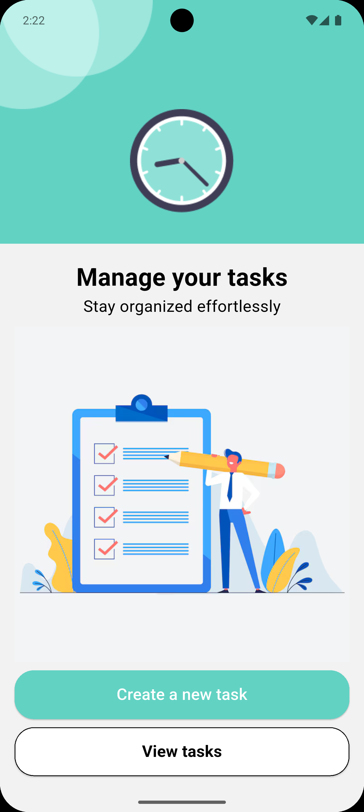
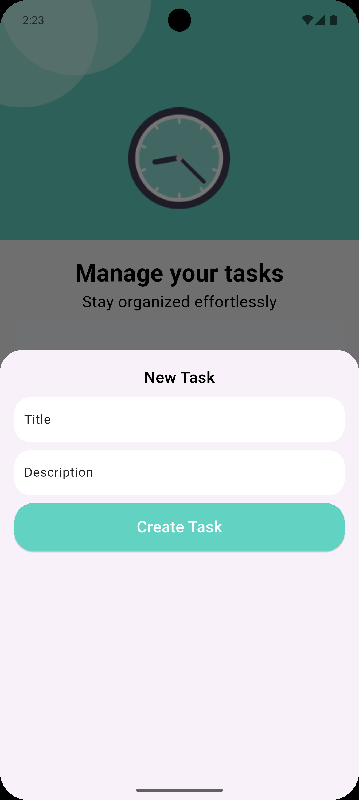
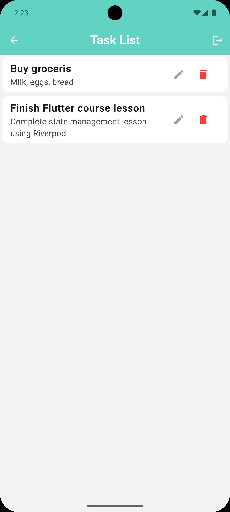

# ✅ ToDo App

A modern **ToDo mobile application** built with **Flutter**, following **MVVM Architecture** principles.  
The app helps users manage daily tasks efficiently with secure authentication and offline support.

---

## ✨ Features

- 🔐 **User login & registration** with Firebase Authentication
- 📝 **CRUD operations**: create, read, update, and delete tasks
- 📦 **Offline storage** with Hive DB
- 🏗️ **MVVM Architecture** for maintainability and scalability

---

## 🛠️ Technologies

- **Flutter** (Dart)
- **Riverpod** (State Management)
- **Firebase Authentication**
- **Hive DB** (local database)
- **MVVM Architecture**

---

## 📸 Screenshots

| Dashboard Page                             | Add Task                                  | Task List Page                           |
|--------------------------------------------|-------------------------------------------|------------------------------------------|
|  |  |  |

---

## 🚀 Getting Started

1. **Clone the repository**
   ```bash
   git clone https://github.com/Jamshid-Mominjonov/todo_app.git
   
2. **Install dependencies**
    ```bash
    flutter pub get
    ```

3. **Run the app**
    ```bash
    flutter run
    ```

## 📄 License

This project is licensed under the **MIT License** – see the [LICENSE](LICENSE) file for details.

---

## 👨‍💻 Author

**Jamshid Mo'minjonov**  
📧 [jamshidmominjonov05@gmail.com](mailto:jamshidmominjonov05@gmail.com)

---

## 🔗 Connect with me

- [LinkedIn](https://www.linkedin.com/in/Jamshid-mominjonov-55ba19294)
- [GitHub](https://github.com/Jamshid-Mominjonov)